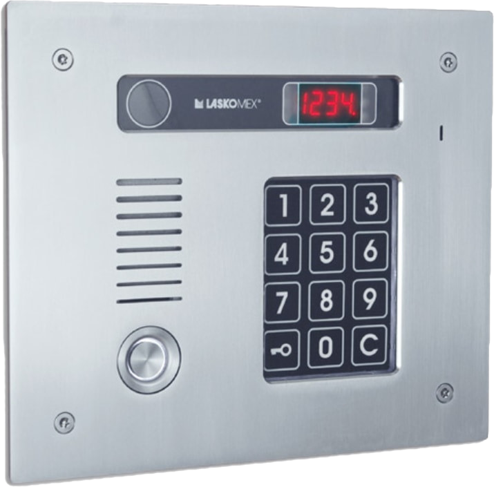
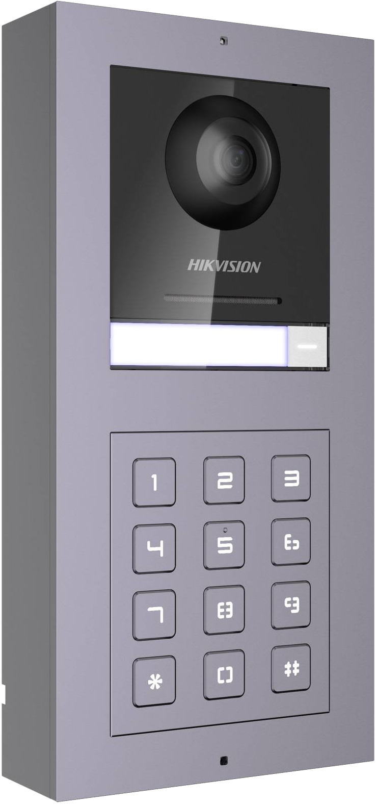
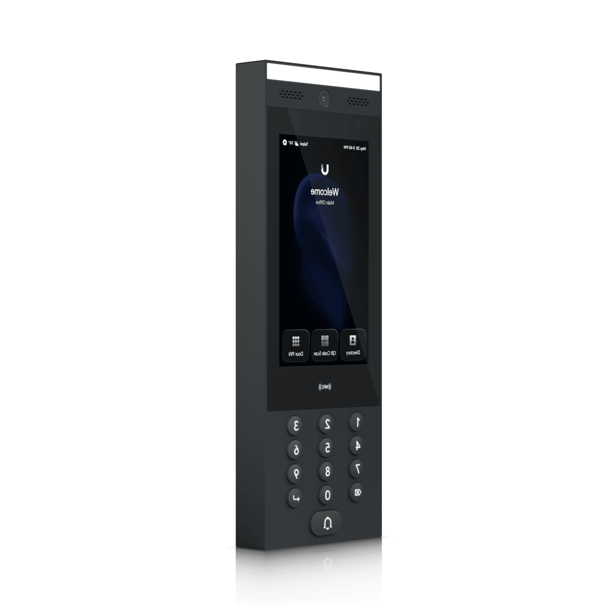

# Systemy domofonowe

Dokument przedstawia analizę dostępnych rozwiązań w zakresie systemów domofonowych.  
Celem opracowania jest wybór najlepszego rozwiązania, które zapewni bezpieczeństwo, wygodę i trwałość na lata.

---

## Aktualny system domofonowy

Obecnie w budynku funkcjonuje centrala **Laskomex CD-250** wraz z unifonami **Laskomex LM-8W-6**.  
Jest to **cyfrowy system magistralowy**, w którym komunikacja opiera się na dwuprzewodowej linii cyfrowej. Wszystkie unifony korzystają ze wspólnej magistrali,
a identyfikacja odbywa się poprzez przypisany numer lokalu.

System umożliwia wyłącznie **rozmowę głosową** oraz **zdalne otwarcie drzwi wejściowych**.

Technologia CD-250 pojawiła się na rynku około **25 lat temu**. Choć urządzenia są stabilne i proste w obsłudze, ich funkcjonalność jest mocno ograniczona w
porównaniu ze współczesnymi rozwiązaniami. W kolejnych latach utrzymanie systemu może stać się coraz trudniejsze ze względu na malejącą dostępność części i
kompatybilnych urządzeń.

---

## Dlaczego zmiana jest potrzebna?

- Coraz częstsze awarie powodują wysokie koszty utrzymania obecnej instalacji.
- System opiera się na technologii sprzed dwóch dekad, obsługując wyłącznie rozmowy głosowe.
- Brakuje funkcji, które obecnie stanowią standard – wideorozmowy, elastyczne opcje dostępu, integracja z nowoczesnymi rozwiązaniami.
- Dostępność części będzie stopniowo malała, co w przyszłości może utrudnić naprawy lub całkowicie je uniemożliwić.

---

## Wymagania i cele

Nowy system domofonowy powinien być trwały, niezawodny i wygodny w codziennym użytkowaniu.  
Przy wyborze istotne są następujące kryteria:

### Wymagania podstawowe

- Obsługa minimum 8 lokali mieszkalnych
- Klawiatura kodowa przy obu wejściach
- Możliwość definiowania kodów PIN dedykowanych poszczególnym lokalom
- Rozmowy audio z głównym wejściem
- Odporność na warunki atmosferyczne (min. IP54)
- Wysoka odporność mechaniczna (min. IK7)
- Gwarancja min. 24 miesiące oraz dostępność serwisu i części w Polsce przez minimum 10 lat

### Funkcje opcjonalne

- Rozmowy wideo z dowolnym wejściem
- Możliwość wyboru urządzeń wyłącznie audio w poszczególnych mieszkaniach
- Integracja z aplikacją mobilną (dla chętnych)

---

## Bezpieczeństwo i wygoda codzienna

- **Bezpieczeństwo** – kamery pokazują, kto stoi przy drzwiach, a panele są odporne na uszkodzenia.
- **Łatwe otwieranie** – drzwi można odblokować kodem PIN lub brelokiem, bez szukania kluczy.
- **Komfort** – dodatkowe unifony lub monitory pozwalają odebrać wywołanie w dowolnym pomieszczeniu.
- **Niezawodność** – części i serwis są dostępne w Polsce, więc system będzie działał stabilnie przez lata.
- **Elastyczność** – system nie wymaga aplikacji, ale dla chętnych dostępna jest obsługa ze smartfona.

---

## Architektura systemów

Na rynku dominują trzy typy rozwiązań:

### 2-żyłowy system cyfrowy (audio lub wideo)

Najprostsze i najtańsze rozwiązanie, często stosowane w starszych budynkach.

#### Zalety

- Niski koszt zakupu
- Możliwość wykorzystania istniejącego okablowania

#### Wady

- Ograniczona jakość obrazu i brak nowoczesnych funkcji

### IP (PoE lub Wi-Fi)

Rozwiązanie nowoczesne, oferujące najwyższą jakość obrazu i dźwięku, a także integrację z innymi systemami bezpieczeństwa.

#### Zalety

- Wysoka jakość audio i wideo
- Łatwa rozbudowa i integracja

#### Wady

- Wyższy koszt początkowy
- Konieczność posiadania sieci Ethernet

#### Kable internetowe

Lista publicznie dostępnych dokumentów:

- [`Kable internetowe`](./ethernet-cables.md)

### Hybryda (2-żyłowy + bramka IP)

Rozwiązanie pośrednie – pozwala korzystać z prostego okablowania, a jednocześnie daje możliwość rozbudowy o funkcje „smart”.

---

## Analiza wybranych systemów

### Laskomex CD-3100 — 2-żyłowy

  

#### Producent

Laskomex (PL) — ponad 30 lat na rynku, szeroka baza instalacji referencyjnych; dobry dostęp do części.

#### Model i seria

**CD-3100** to rozbudowany system 2-żyłowy, stanowiący następcę starszych central (np. CD-250).

#### Zalety

- Niższy koszt początkowy niż systemy IP
- Możliwość wykorzystania istniejącego okablowania
- Stabilna i sprawdzona technologia, szeroko stosowana w Polsce
- Łatwo dostępne części i serwis
- Prosta obsługa, znana lokalnym instalatorom

#### Wady

- Technologia przestarzała, ograniczona funkcjonalność
- Niższa jakość obrazu niż w systemach IP
- Awaria linii magistralnej wpływa na wielu użytkowników jednocześnie
- Dodatkowe funkcje wymagają modułów, co podnosi koszty
- Zależność od jednego producenta

#### Linki

- [Strona producenta](https://www.laskomex.com.pl/)
- [Strona produktu](https://www.laskomex.com.pl/produkty/domofony-cyfrowe.php)
- [Lista produktów](https://www.laskomex.com.pl/produkty/produkty.php)
- [Karty katalogowe](https://www.laskomex.com.pl/karty-katalogowe.php)
- [Cennik producenta](https://www.laskomex.com.pl/cennik/cyfrowe_072025v1.pdf)

#### Popularne elementy zestawu

| Typ podzespołu          | Nazwa podzespołu   | Alarm-Tech  | EC System   | Allegro   |
|-------------------------|--------------------|-------------|-------------|-----------|
| Panel zewnętrzny        | CP-3113R INOX RFID | 1 353,00 zł | 1 353,00 zł | - zł      |
| Kaseta elektroniki      | EC-3100R-2         | 485,85 zł   | 485,85 zł   | 465,12 zł |
| Zasilacz                | TR/B 2303          | 123,00 zł   | 123,00 zł   | 115,00 zł |
| Moduł kamery            | KAM-3-1            | 282,90 zł   | - zł        | 253,63 zł |
| Unifon                  | 1131/621           | 98,40 zł    | 98,40 zł    | - zł      |
| Monitor wideodomofonowy | MVC-8151-1         | 601,47 zł   | 750,30 zł   | 708,52 zł |

#### Przykładowy zestaw (8 lokali, 2 wejścia)

| Typ podzespołu          | Nazwa podzespołu   | Ilość | Cena za szt. | Koszt           |
|-------------------------|--------------------|-------|--------------|-----------------|
| Panel zewnętrzny        | CP-3113R INOX RFID | 2     | 1 353,00 zł  | 2 706,00 zł     |
| Kaseta elektroniki      | EC-3100R-2         | 1     | 465,12 zł    | 465,12 zł       |
| Zasilacz                | TR/B 2303          | 2     | 123,00 zł    | 246,00 zł       |
| Moduł kamery            | KAM-3-1            | 2     | 253,63 zł    | 507,26 zł       |
| Monitor wideodomofonowy | MVC-8151-1         | 8     | 601,47 zł    | 4 811,76 zł     |
| **Razem**               |                    |       |              | **8 736,14 zł** |

#### Inne produkty producenta

- CD-4000
- Bastion Gemini 2-wire IP

#### Uwagi

Obsługa więcej niż jednego przycisku wymaga doprowadzenia dodatkowych przewodów.

---

### Hikvision IP II generacji — IP (PoE)

  

#### Producent

Hikvision (CN) — globalny lider w dziedzinie systemów monitoringu i wideodomofonii; szeroka dostępność części i serwisu w Polsce; możliwość integracji z CCTV i
aplikacją Hik-Connect.

#### Model i seria

**Seria IP II generacji (PoE)** — nowoczesny system wideodomofonowy w architekturze modułowej.

#### Zalety

- Bardzo dobra jakość obrazu i dźwięku
- Możliwość integracji z monitoringiem wizyjnym
- Łatwa rozbudowa i elastyczność konfiguracji
- Każdy moduł działa niezależnie, prosta wymiana w razie awarii
- Dostępna aplikacja mobilna (dla chętnych)
- Jeden przewód Ethernet (PoE) zapewnia transmisję i zasilanie

#### Wady

- Wyższy koszt początkowy niż systemy 2-żyłowe
- Wymaga stabilnej sieci Ethernet
- Zależność od jednego producenta

#### Linki

- [Strona producenta](https://www.hikvision.com/pl/)
- [Strona produktu](https://www.hikvision.com/pl/products/Video-Intercom-Products/IP-Series/Pro-Series/ds-kd8003-ime1-b-----surface-eu/)
- [Lista produktów](https://www.hikvision.com/pl/products/Video-Intercom-Products/)
- [Karty katalogowe](https://www.hikvision.com/pl/support/download/regional-support/)
- [Broszura](https://www.hikvision.com/content/dam/hikvision/eu/support/brochures/product-brochure/2nd-Generation-IP-Video-Intercom-System-New-Aug.-2022.pdf)
- [Cennik firmy Alarm-Tech](https://www.napad.pl/cenniki/cennik-hikvision-systemy-wideodomofonowe,49.xlsx)

#### Popularne elementy zestawu

| Typ podzespołu          | Nazwa podzespołu  | Alarm-Tech  | EC System   | Allegro     |
|-------------------------|-------------------|-------------|-------------|-------------|
| Moduł stacji bramowej   | DS-KD8003-IME1(B) | 968,26 zł   | 965,55 zł   | 549,00 zł   |
| Moduł klawiatury        | DS-KD-KP          | 656,33 zł   | 655,59 zł   | 362,99 zł   |
| Moduł czytnika kart     | DS-KD-M           | 405,41 zł   | 404,67 zł   | 248,99 zł   |
| Ramka podtynkowa        | DS-KD-ACF2        | 713,40 zł   | 270,60 zł   | 159,90 zł   |
| Ramka podtynkowa        | DS-KD-ACF3        | 337,51 zł   | 335,79 zł   | 209,98 zł   |
| Switch                  | DS-3E0318P-E/M(C) | 1 007,62 zł | - zł        | 699,00 zł   |
| Unifon                  | DS-KH6000-E1      | 307,01 zł   | - zł        | - zł        |
| Monitor wideodomofonowy | DS-KH6100-E1      | 490,03 zł   | - zł        | - zł        |
| Monitor wideodomofonowy | DS-KH6220-LE1     | - zł        | 445,00 zł   | 776,53 zł   |
| Monitor wideodomofonowy | DS-KH6320-WTE1    | 1 517,82 zł | 1 303,80 zł | 735,00 zł   |
| Monitor wideodomofonowy | DS-KH8520-WTE1    | 2 364,06 zł | - zł        | 1 318,00 zł |
| Monitor wideodomofonowy | DS-KH9310-WTE1(B) | 2 249,67 zł | 1 793,34 zł | 997,00 zł   |
| Monitor wideodomofonowy | DS-KH9510-WTE1(B) | 2 826,54 zł | 2 554,71 zł | 1 139,00 zł |

#### Przykładowy zestaw 1 (8 lokali, 2 wejścia, tańsze odbiorniki)

| Typ podzespołu          | Nazwa podzespołu  | Ilość | Cena za szt. | Koszt           |
|-------------------------|-------------------|-------|--------------|-----------------|
| Moduł stacji bramowej   | DS-KD8003-IME1(B) | 2     | 549,00 zł    | 1 098,00 zł     |
| Moduł klawiatury        | DS-KD-KP          | 2     | 362,99 zł    | 725,98 zł       |
| Ramka podtynkowa        | DS-KD-ACF2        | 2     | 159,90 zł    | 319,80 zł       |
| Switch                  | DS-3E0318P-E/M(C) | 1     | 699,00 zł    | 699,00 zł       |
| Monitor wideodomofonowy | DS-KH6220-LE1     | 8     | 445,00 zł    | 3 560,00 zł     |
| **Razem**               |                   |       |              | **6 402,78 zł** |

#### Przykładowy zestaw 2 (8 lokali, 2 wejścia, nowsze odbiorniki)

| Typ podzespołu          | Nazwa podzespołu  | Ilość | Cena za szt. | Koszt           |
|-------------------------|-------------------|-------|--------------|-----------------|
| Moduł stacji bramowej   | DS-KD8003-IME1(B) | 2     | 549,00 zł    | 1 098,00 zł     |
| Moduł klawiatury        | DS-KD-KP          | 2     | 362,99 zł    | 725,98 zł       |
| Ramka podtynkowa        | DS-KD-ACF2        | 2     | 159,90 zł    | 319,80 zł       |
| Switch                  | DS-3E0318P-E/M(C) | 1     | 699,00 zł    | 699,00 zł       |
| Monitor wideodomofonowy | DS-KH6320-WTE1    | 8     | 735,00 zł    | 5 880,00 zł     |
| **Razem**               |                   |       |              | **8 722,78 zł** |

#### Kontrola domknięcia drzwi

Jednym z najważniejszych elementów bezpieczeństwa jest pewność, że drzwi wejściowe zostały prawidłowo zamknięte po każdym użyciu.  
Aby to osiągnąć, w proponowanym rozwiązaniu zastosowany może być **elektrozaczep Bira Hartte XS12UM** – model o wąskiej konstrukcji, wyposażony w funkcję
**monitorowania pozycji języka**.

##### Elektrozaczep Bira Hartte XS12UM

- Wąski (standard „XS”) – umożliwia montaż nawet w drzwiach o ograniczonej przestrzeni w futrynie.
- Zasilanie 12 V AC/DC, z niskim poborem prądu.
- Wbudowany **mikroprzełącznik monitorujący** pozycję języka – pozwala stwierdzić, czy drzwi zostały faktycznie domknięte.
- Konstrukcja zapewnia wysoką odporność mechaniczną i trwałość w codziennym użytkowaniu.
- Dobrze współpracuje z systemami kontroli dostępu i wideodomofonami Hikvision.

Dzięki takiemu rozwiązaniu system może nie tylko sterować otwieraniem drzwi, ale także **sygnalizować, gdy drzwi pozostają uchylone**.

##### Warystor – ochrona elektroniki

Podczas pracy elektrozaczepu, szczególnie przy zasilaniu cewki, mogą powstawać przepięcia elektryczne (tzw. szpilki). Aby chronić zarówno elektrozaczep, jak i
moduły domofonowe, zaleca się zastosowanie **warystora** montowanego równolegle do cewki.

- Rekomendowany model: **MOV-14D180K** (18 V, średnica 14 mm).
- Działanie: pochłania nagłe skoki napięcia powyżej wartości progowej, zapobiegając uszkodzeniom.
- Koszt elementu to kilka/kilkanaście złotych, a znacząco wydłuża żywotność całego układu.

##### Konfiguracja wideodomofonu Hikvision

Panel DS-KD8003-IME1(B) posiada wejścia alarmowe (AIN1, AIN2), które można skonfigurować jako „door contact”.

1. **Podłączenie**: styk monitorujący elektrozaczepu XS12UM należy podłączyć do wejścia AIN1.
2. **Ustawienia w menu**: w aplikacji konfiguracyjnej lub w iVMS-4200 wybiera się typ wejścia = *door contact*.
3. **Czas alarmu**: system umożliwia ustawienie zwłoki alarmu – np. 15 lub 30 sekund.
   Dzięki temu alarm uruchamia się dopiero wtedy, gdy drzwi pozostają uchylone dłużej niż określony czas.
4. **Reakcja systemu**: możliwe jest uruchomienie sygnału dźwiękowego w panelu,
   komunikatu na monitorach lokatorskich oraz powiadomienia w aplikacji mobilnej (dla chętnych).

Dzięki takiej konfiguracji nowy system nie tylko pozwala na wygodne otwieranie drzwi, ale również aktywnie dba o to, aby drzwi wejściowe były zawsze zamknięte,
a budynek odpowiednio chroniony.

#### Uwagi

- Ceny podane w tabelach pochodzą z oferty firmy Alarm-Tech, w której zastosowano dodatkowy rabat (oferta nr 44204/GŁ/09/2025). Mogą one różnić się od cen
  widocznych bezpośrednio na stronie producenta i u innych dystrybutorów.
- Na rynku (np. na Allegro) dostępne są również tańsze odpowiedniki niektórych elementów, takich jak moduły czy ramki podtynkowe. Przykładowo: moduł czytnika
  kart wraz z ramką dostępny jest w cenie ok. 154,99 zł.

---

### Ubiquiti UniFi G3 Intercom — IP (PoE)

  

#### Producent

Ubiquiti (USA) — ceniony zwłaszcza w środowiskach IT i instalacjach sieciowych; ekosystem UniFi pozwala scentralizować zarządzanie siecią, monitoringiem i
kontrolą dostępu; w Polsce obsługa i części są coraz bardziej dostępne dzięki popularności tej marki.

#### Model i seria

**G3 Intercom** — nowoczesny wideodomofon IP z dotykowym ekranem i kamerą HD, zaprojektowany do pracy w ramach ekosystemu UniFi Access.

#### Zalety

- Bardzo wysoka jakość obrazu i dźwięku (kamera 5 MP, szeroki kąt, dwukierunkowe audio)
- Ekran dotykowy 7″ z katalogiem lokatorów i możliwością wpisywania PIN-ów
- Obsługa wielu metod dostępu: NFC (MIFARE/DESFire), PIN, kod QR, mobilne klucze (Apple Wallet, Google Wallet, UniFi Identity)
- Integracja z siecią UniFi i systemami monitoringu tego producenta
- Prosta rozbudowa systemu
- Zasilanie PoE — jeden przewód Ethernet zapewnia dane i energię

#### Wady

- Wyższy koszt początkowy niż w systemach 2-żyłowych
- Wymaga pełnej infrastruktury UniFi Access (Access Hub, switch PoE, okablowanie Ethernet)
- Mniejsza dostępność instalatorów specjalizujących się w tym systemie w Polsce niż w przypadku Hikvision

#### Linki

- [Strona producenta](https://ui.com/us/pl)
- [Strona produktu](https://eu.store.ui.com/eu/en/category/door-access-readers/collections/access-intercom/products/ua-g3-intercom?variant=ua-g3-intercom)
- [Lista produktów](https://www.ui.com/us/pl/physical-security/door-access/intercoms)

#### Popularne elementy zestawu

| Typ podzespołu     | Nazwa podzespołu        | Kod producenta            | Ubiquiti | Cena w PLN  | Allegro     |
|--------------------|-------------------------|---------------------------|----------|-------------|-------------|
| Panel zewnętrzny   | G3 Intercom             | UA-G3-Intercom            | 418,20 € | 1 780,65 zł | - zł        |
| Kaseta elektroniki | Door Hub Mini           | UA-Hub-Door-Mini          | 121,77 € | 518,05 zł   | - zł        |
| Kaseta elektroniki | Door Hub                | UA-Hub-Door               | 227,55 € | 968,08 zł   | - zł        |
| Switch             | Pro Max 16 PoE          | USW-Pro-Max-16-PoE (180W) | 453,87 € | 1 930,98 zł | 1 622,57 zł |
| Panel wewnętrzny   | Intercom Viewer         | UA-Intercom-Viewer        | 170,97 € | 727,97 zł   | 659,70 zł   |
| Panel wewnętrzny   | Intercom Viewer (3-pak) | UA-Intercom-Viewer-3      | 498,15 € | 2 119,78 zł | 2 162,31 zł |

#### Przykładowy zestaw 1 (8 lokali, 2 wejścia)

| Typ podzespołu     | Nazwa podzespołu        | Ilość | Cena za szt. | Koszt            |
|--------------------|-------------------------|-------|--------------|------------------|
| Panel zewnętrzny   | G3 Intercom             | 2     | 1 780,65 zł  | 3 561,30 zł      |
| Kaseta elektroniki | Door Hub Mini           | 2     | 518,05 zł    | 1 036,10 zł      |
| Switch             | Pro Max 16 PoE          | 1     | 1 622,57 zł  | 1 622,57 zł      |
| Panel wewnętrzny   | Intercom Viewer         | 8     | 659,70 zł    | 5 277,60 zł      |
| **Razem**          |                         |       |              | **11 497,57 zł** |

#### Przykładowy zestaw 2 (8 lokali, 2 wejścia, 2 kontrole domknięcia drzwi)

| Typ podzespołu     | Nazwa podzespołu        | Ilość | Cena za szt. | Koszt            |
|--------------------|-------------------------|-------|--------------|------------------|
| Panel zewnętrzny   | G3 Intercom             | 2     | 1 780,65 zł  | 3 561,30 zł      |
| Kaseta elektroniki | Door Hub                | 2     | 968,08 zł    | 1 936,16 zł      |
| Switch             | Pro Max 16 PoE          | 1     | 1 622,57 zł  | 1 622,57 zł      |
| Panel wewnętrzny   | Intercom Viewer         | 8     | 659,70 zł    | 5 277,60 zł      |
| **Razem**          |                         |       |              | **12 397,63 zł** |

#### Kontrola domknięcia drzwi

Ubiquiti Access Hub umożliwia podłączenie czujników otwarcia drzwi (door contact). Do współpracy można zastosować elektrozaczepy monitorowane (np. **Bira Hartte
XS12UM**), które wysyłają sygnał o pozycji języka do kontrolera. System rejestruje każde niedomknięcie drzwi i może uruchamiać alarmy, powiadomienia w aplikacji
UniFi Identity lub zapisywać zdarzenie w logach.

#### Uwagi

- System Ubiquiti jest stosunkowo nowy na polskim rynku wideodomofonów, dlatego dostępność instalatorów i serwisu może być mniejsza niż w przypadku Hikvision.
- Atutem jest możliwość używania **mobilnych kluczy (Apple Wallet, Google Wallet)**, co czyni go jednym z bardziej nowoczesnych rozwiązań dla budynków
  wielorodzinnych.

---

### ACO (CDN / Inspiro) — 2-żyłowy audio/wideo + bramka acoGO!

#### Producent

ACO (PL) — polski producent, znany i ceniony w budownictwie wielorodzinnym; szeroka dostępność części i serwisu w Polsce.

#### Model i seria

**CDN** oraz **Inspiro** — systemy 2-żyłowe, umożliwiające obsługę audio i wideo, z opcjonalną bramką **acoGO!** pozwalającą na obsługę przez aplikację mobilną.

#### Zalety

- Popularny i sprawdzony system w Polsce.
- Możliwość pracy na okablowaniu 2-żyłowym.
- Obsługa audio i wideo.
- Opcjonalna bramka acoGO! dla integracji ze smartfonem.
- Wysoka dostępność serwisu i części.

#### Wady

- Jakość obrazu i dźwięku niższa niż w systemach IP.
- Rozbudowa ograniczona w porównaniu do IP.
- Koszt bramki acoGO! podnosi cenę instalacji.
- Architektura magistralowa (awaria linii wpływa na wiele lokali).

#### Linki

- [Strona producenta](https://www.aco.com.pl/)
- [ACO Inspiro](https://www.aco.com.pl/pl/domofony-inspiro)
- [ACO CDN](https://www.aco.com.pl/pl/domofony-cdn)

#### Uwagi

System bardzo popularny w Polsce, dobry kompromis między prostotą a funkcjonalnością.

---

### Urmet (2Voice / Matibus SE) — 2-żyłowy audio/wideo

#### Producent

Urmet (IT) — włoski producent, od dziesięcioleci obecny w Polsce; znana marka w segmencie domofonów i wideodomofonów.

#### Model i seria

**2Voice** oraz **Matibus SE** — systemy 2-żyłowe audio/wideo stosowane w budynkach wielorodzinnych.

#### Zalety

- Duża rozpoznawalność marki, częste instalacje w Polsce.
- Stabilny system 2-żyłowy audio/wideo.
- Obsługa wielu lokali i wejść.
- Dobra dostępność części i serwisu.

#### Wady

- Ograniczona elastyczność i skalowanie w porównaniu do IP.
- Niższa jakość obrazu niż w systemach IP.
- Wyższy koszt w porównaniu do prostych systemów 2-żyłowych (np. Cyfral).

#### Linki

- [Strona producenta](https://www.urmet.com/)
- [Urmet Polska](https://urmetpolska.pl/)

#### Uwagi

Popularny wybór w kamienicach i blokach; solidne rozwiązanie, choć mniej nowoczesne niż IP.

---

### Cyfral (PC-4000 / SMART-D) — 2-żyłowy audio/wideo

#### Producent

Cyfral (PL) — polski producent, specjalizujący się w prostych i niedrogich systemach dla budownictwa wielorodzinnego.

#### Model i seria

**PC-4000** oraz **SMART-D** — systemy 2-żyłowe, obsługujące audio i wideo.

#### Zalety

- Niski koszt zakupu.
- Obsługa istniejącego okablowania 2-żyłowego.
- Łatwa instalacja i konfiguracja.
- Polski producent z dostępnością części.

#### Wady

- Ograniczona funkcjonalność względem IP.
- Mniejsza elastyczność rozbudowy.
- Jakość obrazu niższa niż w systemach IP.
- Mniej nowoczesny design urządzeń.

#### Linki

- [Strona producenta](https://www.cyfral.pl/)

#### Uwagi

Rozwiązanie budżetowe, dobre dla prostych instalacji.

---

### Vidos Duo — 2-żyłowy wideo

#### Producent

Vidos (CN/PL dystrybucja) — marka oferująca wideodomofony 2-żyłowe i IP, dostępna w wielu sklepach w Polsce.

#### Model i seria

**Vidos Duo** — system 2-żyłowy wideodomofonowy, przeznaczony do budynków jedno- i wielorodzinnych.

#### Zalety

- Atrakcyjny koszt w porównaniu do innych systemów wideo.
- Obsługa okablowania 2-żyłowego.
- Dostępne różne modele monitorów i paneli.
- Popularność w Polsce, szeroka dystrybucja.

#### Wady

- Brak pełnej integracji z aplikacjami mobilnymi (dodatkowe moduły wymagane).
- Niższa jakość obrazu niż IP.
- Ograniczona elastyczność rozbudowy.

#### Linki

- [Strona producenta](https://vidos.pl/)

#### Uwagi

System średniopółkowy, chętnie wybierany w mniejszych wspólnotach.

---

### Dahua IP — IP (PoE) wideo

#### Producent

Dahua (CN) — jeden z największych producentów systemów bezpieczeństwa na świecie; bezpośredni konkurent Hikvision.

#### Model i seria

**Dahua IP** — system wideodomofonowy IP zasilany PoE, z bogatą ofertą monitorów i modułów.

#### Zalety

- Wysoka jakość obrazu i dźwięku.
- Integracja z systemami CCTV Dahua.
- Łatwa rozbudowa i elastyczność konfiguracji.
- Duży wybór monitorów i akcesoriów.

#### Wady

- Wyższy koszt początkowy niż systemy 2-żyłowe.
- Zależność od jednego producenta.
- Wymaga sieci Ethernet.

#### Linki

- [Strona producenta](https://www.dahuasecurity.com/)

#### Uwagi

Alternatywa dla Hikvision, o zbliżonej funkcjonalności i cenach.

---

### Fermax MEET — IP

#### Producent

Fermax (ES) — hiszpański producent, od lat obecny w Polsce, specjalizujący się w systemach wideodomofonowych.

#### Model i seria

**MEET** — system wideodomofonowy IP, zasilany PoE, z zaawansowanymi funkcjami.

#### Zalety

- Profesjonalny system IP.
- Wysoka jakość obrazu i dźwięku.
- Nowoczesny design urządzeń.
- Integracja z aplikacją mobilną.

#### Wady

- Wyższy koszt niż systemy 2-żyłowe.
- Mniejsza popularność w Polsce niż Hikvision czy Dahua → mniejsza dostępność części.
- Wymaga instalatora z doświadczeniem w IP.

#### Linki

- [Strona producenta](https://www.fermax.com/)

#### Uwagi

Rozwiązanie klasy średniej/wyższej, dobre dla wymagających instalacji.

---

### 2N Helios IP Verso — IP

#### Producent

2N (CZ, część grupy Axis) — czeski producent, specjalizujący się w systemach klasy premium, z integracją z systemami kontroli dostępu.

#### Model i seria

**Helios IP Verso** — modułowy system wideodomofonowy IP, stosowany w biurowcach i prestiżowych inwestycjach.

#### Zalety

- Bardzo wysoka jakość wykonania.
- Modułowa konstrukcja, łatwa rozbudowa.
- Integracja z systemami kontroli dostępu i CCTV.
- Długoterminowe wsparcie producenta.

#### Wady

- Wysoka cena (rozwiązanie premium).
- Zależność od jednego producenta.
- Mniejsza popularność w budynkach mieszkalnych (bardziej w biurowcach).

#### Linki

- [Strona producenta](https://www.2n.com/)

#### Uwagi

Rozwiązanie klasy premium, raczej poza zakresem budżetu wspólnot mieszkaniowych.

---

### Elfon Optima (OP-255R) — 2-żyłowy audio

#### Producent

Elfon (PL) — polski producent domofonów, mniej znany niż ACO czy Laskomex, ale obecny na rynku od lat.

#### Model i seria

**Optima (OP-255R)** — prosty system 2-żyłowy audio.

#### Zalety

- Polski producent, łatwa dostępność części.
- Niska cena w porównaniu z systemami wideo.
- Prosta obsługa i montaż.
- Stabilne działanie w prostych instalacjach.

#### Wady

- Brak obsługi wideo.
- Ograniczona funkcjonalność w porównaniu do nowoczesnych systemów.
- Mała rozpoznawalność marki w porównaniu z ACO czy Urmet.

#### Linki

- [Strona producenta](https://www.elfon.com.pl/)

#### Uwagi

System niszowy, odpowiedni głównie dla prostych instalacji audio.

---

## Podsumowanie

Analiza dostępnych systemów wskazuje, że wybór nowego rozwiązania powinien być podyktowany przede wszystkim **bezpieczeństwem, wygodą i długowiecznością**.

Oba rozpatrywane systemy spełniają podstawowe wymagania, jednak różnią się poziomem nowoczesności i kosztami.

- **Laskomex CD-3100**: tańsze rozwiązanie, wykorzystujące istniejące okablowanie, dobrze znane instalatorom.
- **Hikvision IP II generacji**: nowoczesny system o wyższej jakości obrazu, z możliwością rozbudowy i integracji z innymi systemami.

Ostateczny wybór powinien uwzględniać **równowagę między kosztami a oczekiwaniami mieszkańców**.

---

## Najczęściej zadawane pytania (FAQ)

- **Czy będziemy musieli korzystać z aplikacji na telefonie?**  
  Nie, aplikacja to tylko opcja dla zainteresowanych. System działa w pełni także bez niej.

- **Czy trzeba będzie wymieniać wszystkie przewody w budynku?**  
  W przypadku systemu IP potrzebne są przewody Ethernet, natomiast system 2-żyłowy może korzystać z obecnej instalacji.

- **Czy obsługa będzie skomplikowana?**  
  Nie, otwieranie drzwi możliwe jest za pomocą kodu PIN, breloka RFID lub przycisku na unifonie/monitorze.

- **Czy serwis będzie łatwo dostępny?**  
  Tak, oba systemy mają zapewnioną obsługę i części zamienne w Polsce.  
